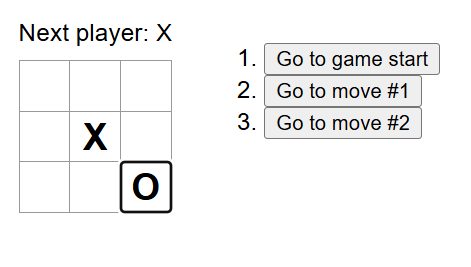

# Tic-Tac-Toe Game in React

## Overview
This is a simple Tic-Tac-Toe game built using **React**. The game allows two players to take turns, tracks the history of moves, and allows users to review previous states of the game.

## Features
- Play Tic-Tac-Toe interactively.
- Displays the next player.
- Displays the winner when the game is won.
- Tracks and stores game history.
- Allows players to navigate to previous moves.

## Installation and Setup
### Prerequisites
Make sure you have **Node.js** and **npm** installed on your machine.

#### Install Node.js and npm (if not installed)
1. Download and install Node.js from [nodejs.org](https://nodejs.org/).
2. Verify the installation:
   ```sh
   node -v
   npm -v
   ```
   This should output the installed versions of Node.js and npm.

### Clone the Repository
```sh
git clone https://github.com/your-username/tic-tac-toe-react.git
cd tic-tac-toe-react
```

### Install Dependencies
```sh
npm install
```

## Running the Game
Start the development server:
```sh
npm start
```
This will launch the game in your default web browser at:
```
http://localhost:3000
```

## Project Structure
```
├── src
│   ├── index.js        # Main entry point
│   ├── App.js          # Main component
│   ├── styles.css      # Styling
├── public
│   ├── index.html      # HTML template
├── package.json        # Project dependencies
```

## Screenshots
Below are some images of the game in action:


## Future Enhancements
- Improve UI styling.
- Implement a restart button.
- Add AI player option.
- For the current move only, show "You are at move #..." instead of a button.
- Rewrite Board to use two loops to make the squares instead of hardcoding them.
- Add a toggle button that lets you sort the moves in either ascending or descending order.
- When someone wins, highlight the three squares that caused the win (and when no one wins, display a message about the result being a draw).
- Display the location for each move in the format (row, col) in the move history list.
  
---
Enjoy playing Tic-Tac-Toe! 🎉
